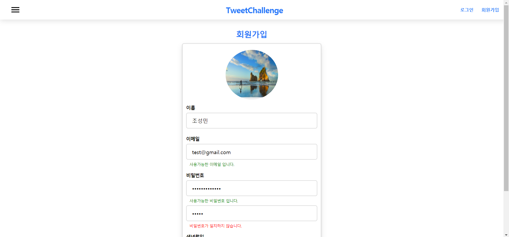
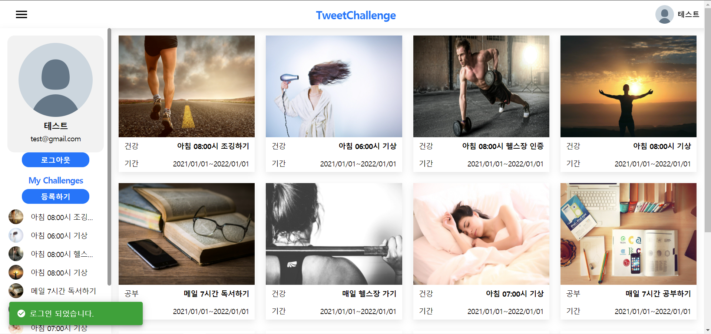
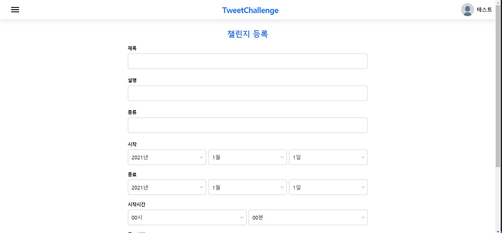

# TweetChallenge

## Introduce
TypeScript를 학습하고 리액트 프로젝트에 적용하기 위한 개인프로젝트입니다.
현재 로그인, 회원가입, 챌린지 등록, 목록보기 기능이 구현되어 있으며 현재 개인적으로 진행한 토이 프로젝트 입니다.

## Tech
- TypeScript
- React
- React-Redux
- Redux-Saga
- React-Router
- SCSS
- axios
- express

## 로그인, 회원가입
- 회원가입, 로그인관련한 Auth기능을 JWT TOKEN 인증방식을 사용하여 구현하였습니다.
- 로그인 관련한 redux, redux-saga를 이용해 auth관련한 상태를 글로벌하게 관리할 수 있도록 하였습니다.
- [User Store Code](https://github.com/HelloMandu/TweetChallenge/blob/master/src/store/user.ts)
- [User Backend Code](https://github.com/HelloMandu/TweetChallenge/blob/master/server/routes/user.js)

   

## 챌린지 목록
- 등록된 Challenge 목록을 인피니티 스크롤을 이용해 구현하였습니다.
- IntersectionObserver를 이용해 리스트가 보여질때 이미지 리소스를 로드하도록 구현하였습니다.
- [Lazy Image Code](https://github.com/HelloMandu/TweetChallenge/blob/master/src/components/LazyImage.tsx)
- [InfiniteScroll Hook Code](https://github.com/HelloMandu/TweetChallenge/blob/master/src/hooks/useScroll.ts)

   

## 챌린지 등록, 상세 보기
- 챌린지 등록, 상세 보기 기능을 구현하였습니다.

   
   

